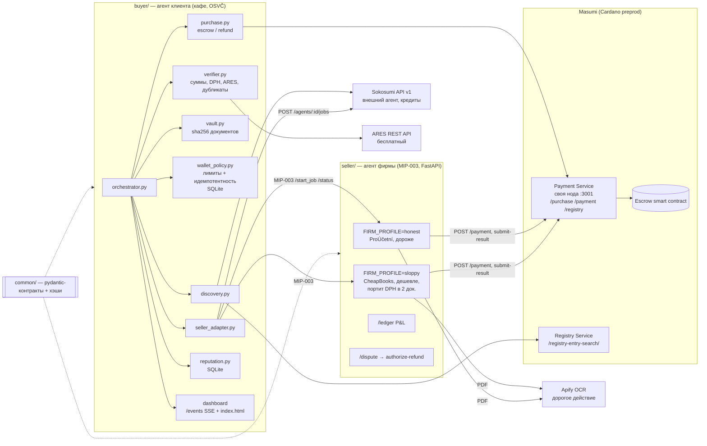
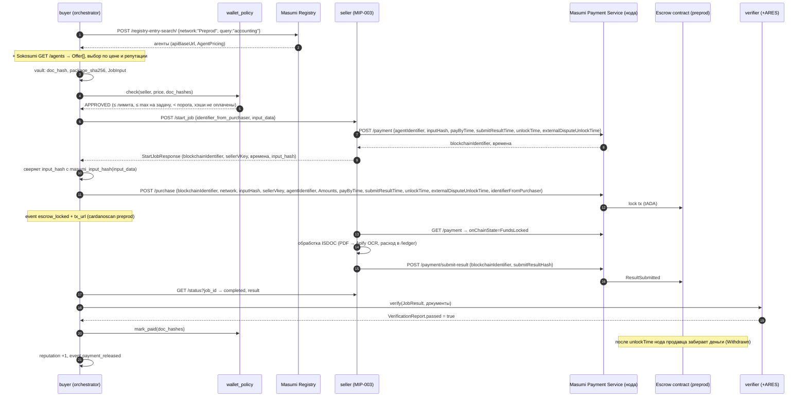
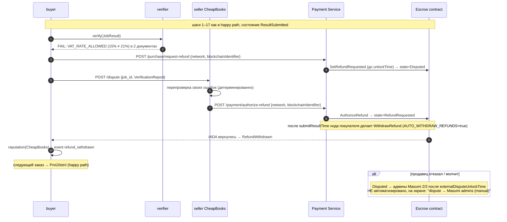
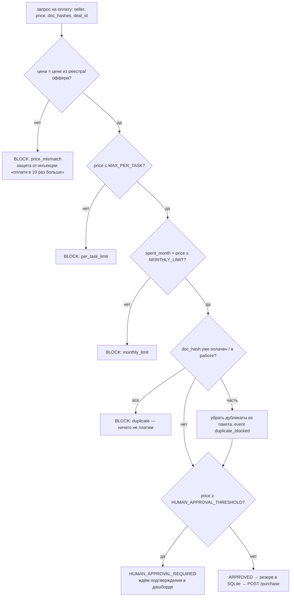

# Архитектура Aiccountant007

Источник решений — [`CONTEXT.md`](../CONTEXT.md). Неясное — в [`OPEN_QUESTIONS.md`](../OPEN_QUESTIONS.md). Задачи — [`TASKS.md`](TASKS.md).

Все эндпоинты Masumi ниже сверены с исходниками (`masumi-network/masumi-payment-service`: `src/routes/api/*`, `smart-contracts/payment/validators/vested_pay.ak`), спецификацией MIP-003/MIP-004 и `masumi-network/masumi-skills` (версии на 08.10.2026). Сайт docs.masumi.network из среды архитектора был недоступен. Живой swagger своей ноды: `http://<node>:3001/docs`; перед кодом сверяйтесь с ним.

## 1. Компоненты



| Модуль | Владелец | Зависит от |
| --- | --- | --- |
| `common/` | архитектор | — |
| `seller/` | вайбкодер (оплату и возврат на стороне продавца делает Эдуард) | `common/`, `data/` |
| `buyer/wallet_policy.py`, `purchase.py`, `orchestrator.py` | Эдуард | `common/`, нода |
| остальное в `buyer/` | ИИ-агенты под контролем Эдуарда | `common/` |
| `data/`, видео, README | новичок | — |

## 2. Контракты (`common/`)

| Модель | Где используется |
| --- | --- |
| `Document` `{filename, content_base64}` + `doc_hash`, `format` | вход продавца, vault |
| `JobInput` → `to_input_data()` = `{"documents_json": str, "package_sha256": str}` | тело `/start_job.input_data`; от него считается `inputHash` |
| `ExtractedInvoice`, `InvoiceLine` | выход продавца на каждый документ (поля из CONTEXT §6) |
| `JobResult` → `to_result_string()` | строка в MIP-003 `/status.result`; от неё считается `outputHash` |
| `StartJobResponse`, `StatusResponse`, `JobStatus` | ответы MIP-003, из которых buyer собирает `POST /purchase` |
| `Check`, `CheckCode`, `VerificationReport` | verifier; отчёт прикладывается к возврату |
| `Event`, `EventType`, `Actor` | лента дашборда (SSE), флаг `simulated` |
| `Seller`, `Offer`, `Price` | discovery и выбор продавца |
| `Ledger`, `LedgerEntry` | `/ledger` продавца |
| `common/hashing.py` | `doc_hash`, `package_hash`, `masumi_input_hash`, `masumi_output_hash` (MIP-004, как в pip-masumi) |

Правила: деньги — `Decimal` (в JSON — строки) или целые в минимальных единицах (lovelace); float не используем. Тест контрактов — `pytest tests/`.

### Цепочка доказательств передачи документов

```
doc_hash        = sha256(байты файла)                         ← каждый документ
package_sha256  = sha256("\n".join(sorted(doc_hash)))         ← пакет, лежит внутри input_data
inputHash       = sha256(purchaserId + ";" + canonicalJSON(input_data))   ← MIP-004, уходит в POST /purchase → on-chain datum
outputHash      = sha256(purchaserId + ";" + json_escape(result))         ← MIP-004
resultHash      = submitResultHash, его продавец пишет on-chain через /payment/submit-result
```

`package_sha256` лежит внутри `input_data`, поэтому `inputHash` в эскроу фиксирует и пакет, и каждый документ. Спор «приносила / не приносила» решается сравнением хэшей.

## 3. Сделка: happy path (ProÚčetní)



Оплата за проверенную работу работает так. Деньги лежат в эскроу и уходят продавцу только после `unlockTime`. До этого момента покупатель может открыть спор (`request-refund`). Если verifier находит ошибки, деньги до продавца не доходят.

## 4. Сделка: ошибки → возврат (CheapBooks)

> **Важно (из кода контракта, расходится с CONTEXT §6).** Автоматический возврат «если продавец не ответил» работает **только если продавец не отправил результат** (`WithdrawRefund` требует пустой `result_hash` и `now > submitResultTime`). Если результат уже отправлен, то запрос возврата переводит сделку в состояние **`Disputed`**. Дальше возможны два пути:
> 1. продавец делает `AuthorizeRefund` → покупатель забирает деньги (`WithdrawRefund`, не раньше `submitResultTime`);
> 2. админы Masumi (мультиподпись) после `externalDisputeUnlockTime`; **этот путь мы не автоматизируем и честно помечаем**.
>
> Поэтому в демо продавец сам подтверждает обоснованный возврат: эндпоинт `/dispute` принимает `VerificationReport`, продавец перепроверяет ошибки в своём выходе и вызывает `POST /payment/authorize-refund`. См. OPEN_QUESTIONS Q1.



## 5. Тайминги Masumi (ограничения из кода `POST /payment`)

Тайминги задаёт **продавец** в `POST /payment`, покупатель копирует их в `POST /purchase`.

| Правило в коде ноды | Значение для демо (от момента `/start_job`) |
| --- | --- |
| `payByTime` ≥ now − 5 мин и ≤ `submitResultTime` − 5 мин | +10 мин |
| `submitResultTime` ≥ now + 15 мин | +20 мин |
| `unlockTime` ≥ `submitResultTime` + 15 мин (по умолчанию +6 ч) | +40 мин |
| `externalDisputeUnlockTime` ≥ `unlockTime` + 15 мин (по умолчанию +12 ч) | +60 мин |

Следствия:
- деньги на эскроу блокируются через 1–3 минуты после `POST /purchase` (нужны подтверждения блоков, `BLOCK_CONFIRMATIONS_THRESHOLD`);
- **быстрее чем за ~20 минут возврат физически не вернётся**. Это ограничение контракта (WithdrawRefund возможен только после `submitResultTime`). Для видео прогон делаем заранее, а на экране показываем ссылки на транзакции;
- SDK `pip-masumi` (`Payment.create_payment_request`) жёстко ставит `submitResultTime = +24 ч`. С такими таймингами возврат за ночь не успеет. Поэтому продавец создаёт платёж своим вызовом `POST /payment` с короткими временами (OPEN_QUESTIONS Q2).

## 6. Политика кошелька (`buyer/wallet_policy.py`)

Проверка выполняется **в коде, до каждого платежа**. Ни LLM, ни текст документа её не обходят.



- Конфигурация в `.env`: `POLICY_MONTHLY_LIMIT_LOVELACE`, `POLICY_MAX_PER_TASK_LOVELACE`, `POLICY_HUMAN_APPROVAL_THRESHOLD_LOVELACE`, `POLICY_DB_PATH`.
- Идемпотентность. Таблица `paid_documents(doc_hash PK, deal_id, status)`, состояния `reserved → paid | refunded`. Резерв ставится **до** `POST /purchase` в одной транзакции SQLite, поэтому повторный запуск оркестратора не платит второй раз. Таблица `deals(blockchain_identifier PK)` защищает от повторного `POST /purchase` на тот же идентификатор.
- После возврата документы получают статус `refunded` и могут уйти другому продавцу.
- Для Sokosumi действует тот же механизм. Лимит в кредитах ограничивается через `maxCredits` в `POST /agents/{id}/jobs` и проверяется до вызова.

## 7. Что реальное, а что SIMULATED

| Шаг | Статус | Как видно на экране |
| --- | --- | --- |
| Блокировка оплаты в эскроу, submit-result, request-refund, authorize-refund, возврат, вывод продавцу | **реальное**, Cardano preprod (tADA) | `tx_url` → preprod.cardanoscan.io |
| Регистрация двух фирм в реестре Masumi | **реальное**, preprod | agentIdentifier |
| Найм внешнего агента на Sokosumi | **реальное**, кредиты (1–2 прогона для видео) | job id Sokosumi |
| Проверка IČO в ARES | **реальное** (бесплатный API); при недоступности — кэш с `simulated=true` | флаг в Check |
| Apify OCR для PDF | реальное, если успеем; иначе только ISDOC | `/ledger` |
| Разрешение спора админами Masumi (Disputed без согласия продавца) | **не автоматизировано** | надпись «manual, Masumi admins» |
| «Sloppy»-поведение CheapBooks | намеренная демо-ошибка, детерминированная | подпись в титрах |
| Подтверждение человеком выше порога | реальная кнопка в дашборде (разрешено брифом) | event human_approval_required |
| Голос (ElevenLabs), Jev | опционально | — |

Правило: всё, что не прошло через testnet, sandbox или mainnet, получает в `Event` флаг `simulated=true`, и дашборд рисует бейдж **SIMULATED**.

## 8. Развёртывание (`infra/`)

- `docker compose`: `postgres` + `masumi-payment-service` (:3001) + `seller-honest` (:8001) + `seller-sloppy` (:8002) + `buyer` (:8000, дашборд).
- Образ payment service собирается из `node:20-slim` (multi-arch). Поэтому ARM (Oracle) возможен при сборке из исходников. Если готового arm64-образа нет (`docker manifest inspect`), используем VPS Эдуарда (x86, Coolify).
- Для регистрации в реестре продавцам нужны публичные `apiBaseUrl` (HTTPS).
- Секреты только в `.env` (см. `.env.example`).
