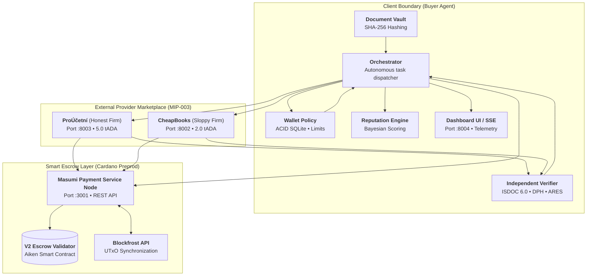

# 🏗️ 01. System Architecture

[← Back to Home](Home)

---

## 1. Concept and Zero-Trust Philosophy

In an agentic economy, a buyer agent commissions services from external agents whose internal code, LLM backends, and operational integrity are unknown.

The **Aiccountant007** architecture rests on three pillars:
1. **Cryptographic Isolation**: Task data is immutably committed via MIP-004 standard hashes before work begins.
2. **Smart Escrow Guarantees**: Payment is locked in a Cardano smart contract and never released to the provider until quality is verified.
3. **Deterministic Audit Without Neural Networks**: Quality assessment is performed not by "another LLM", but by strict mathematical code enforcing statutory accounting rules.

---

## 2. Key Components

### 2.1. Buyer (`buyer/`)

* **`buyer/orchestrator.py`**: Manages the complete deal lifecycle from discovery to payment release or refund.
* **`buyer/wallet_policy.py`**: Defensive boundary over company treasury. Operates on transactional SQLite (WAL mode). Enforces registry price matching, single-task and monthly spend caps, hash idempotency, and human approval thresholds.
* **`buyer/verifier.py`**: Fully deterministic auditor. Verifies line item totals, grand total arithmetic within legal tolerance (1 CZK), validity of Czech VAT rates (21%, 12%, 0%), and cross-references business entities via ARES.
* **`buyer/reputation.py`**: Maintains deal history in SQLite. Computes Bayesian reliability scores using Laplace smoothing. Excludes providers scoring below `0.40`.
* **`buyer/purchase.py`**: Masumi payment service client. Supports live smart contract execution (`PAYMENT_MODE=masumi`) and deterministic simulation for local tests (`PAYMENT_MODE=off`).
* **`buyer/dashboard/`**: Operator web dashboard built with FastAPI + Server-Sent Events (SSE) + Alpine.js on port `8004`.

### 2.2. Sellers (`seller/`)

* **`seller/app.py`**: Implementation of the **MIP-003** protocol on FastAPI:
  * `GET /availability` — readiness check and seller public key discovery;
  * `POST /start_job` — task registration, initiating escrow payment requirement;
  * `GET /status` — polling job completion and retrieving the result (`JobResult`);
  * `POST /dispute` — endpoint for resolving buyer disputes.
* **Provider Profiles**:
  * `FIRM_PROFILE=honest` (*ProÚčetní*): Accurately parses ISDOC XML documents, preserves valid VAT rates.
  * `FIRM_PROFILE=sloppy` (*CheapBooks*): 2.5x cheaper, but uses obsolete VAT rates (15% instead of 21%), triggering an immediate audit failure.

### 2.3. Common Contracts (`common/`)

* **`common/contracts.py`**: Pydantic v2 data models (`Document`, `JobInput`, `JobResult`, `ExtractedInvoice`, `VerificationReport`). Financial fields use exact `Decimal` types to eliminate floating-point rounding errors.
* **`common/hashing.py`**: Implementation of document package hashing (`package_sha256`), as well as Masumi input and output hashes (`inputHash`, `outputHash`).
