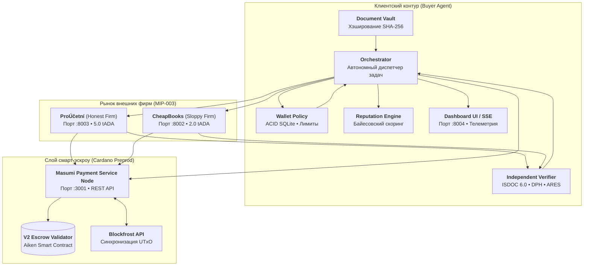

# 🏗️ 01. Архитектура системы

[← Назад на Главную](Home)

---

## 1. Концепция и философия Zero-Trust

В агентной экономике агент-покупатель заказывает услуги у внешних агентов, чей внутренний код, используемые LLM и честность неизвестны. 

Архитектура **Aiccountant007** построена на трёх столпах:
1. **Криптографическая изоляция**: Данные задачи фиксируются хэшами по стандарту MIP-004 до начала работ.
2. **Смарт-эскроу гарантии**: Оплата блокируется в смарт-контракте на блокчейне Cardano и не поступает исполнителю до подтверждения качества.
3. **Детерминированный аудит без участия нейросетей**: Оценка качества работы производится не «другой LLM», а строгим математическим кодом на базе законодательных норм.

---

## 2. Ключевые компоненты

### 2.1. Покупатель (`buyer/`)

* **`buyer/orchestrator.py`**: Управляет всем жизненным циклом сделки от обнаружения до выплаты или возврата.
* **`buyer/wallet_policy.py`**: Защитный слой над кошельком компании. Работает на SQLite в транзакционном режиме (WAL). Проверяет совпадение цены с реестром, непревышение лимитов задачи и месяца, дедупликацию хэшей и порог ручного подтверждения.
* **`buyer/verifier.py`**: Полностью детерминированный аудитор. Проверяет корректность сумм строк, итоговую сумму с учетом допустимой погрешности (1 CZK), легальность ставок чешского НДС (21%, 12%, 0%) и сверяет валидность реквизитов через ARES.
* **`buyer/reputation.py`**: Хранит историю сделок в SQLite. Вычисляет байесовскую оценку надежности по формуле сглаживания Лапласа. Отсекает исполнителей с оценкой ниже `0.40`.
* **`buyer/purchase.py`**: Клиент к сервису платежей Masumi. Поддерживает работу с живым смарт-контрактом (`PAYMENT_MODE=masumi`) и детерминированную симуляцию для локальных тестов (`PAYMENT_MODE=off`).
* **`buyer/dashboard/`**: Веб-интерфейс оператора на FastAPI + Server-Sent Events (SSE) + Alpine.js на порту `8004`.

### 2.2. Продавцы (`seller/`)

* **`seller/app.py`**: Реализация протокола **MIP-003** на базе FastAPI:
  * `GET /availability` — проверка готовности и получение публичного ключа продавца;
  * `POST /start_job` — регистрация задачи, инициирование платежа через эскроу;
  * `GET /status` — опрос готовности и получение результата (`JobResult`);
  * `POST /dispute` — эндпоинт разрешения претензий покупателя.
* **Профили поведения**:
  * `FIRM_PROFILE=honest` (*ProÚčetní*): корректно разбирает XML-документы ISDOC, сохраняет точные ставки НДС.
  * `FIRM_PROFILE=sloppy` (*CheapBooks*): дешевле в 2.5 раза, но использует устаревшие ставки НДС (15% вместо 21%), вызывая гарантированный сбой аудита.

### 2.3. Общие контракты (`common/`)

* **`common/contracts.py`**: Pydantic v2 модели данных (`Document`, `JobInput`, `JobResult`, `ExtractedInvoice`, `VerificationReport`). Финансовые поля используют строгий тип `Decimal` без накопления погрешностей чисел с плавающей точкой.
* **`common/hashing.py`**: Реализация стандартов вычисления хэшей пакета документов (`package_sha256`), а также входных и выходных хэшей Masumi (`inputHash`, `outputHash`).
